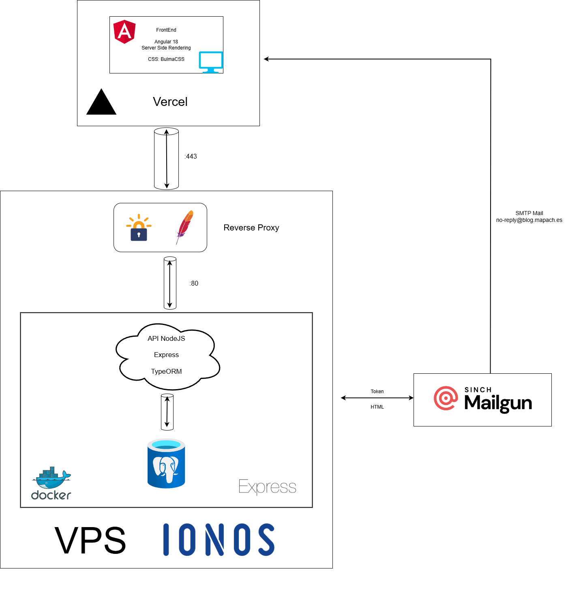
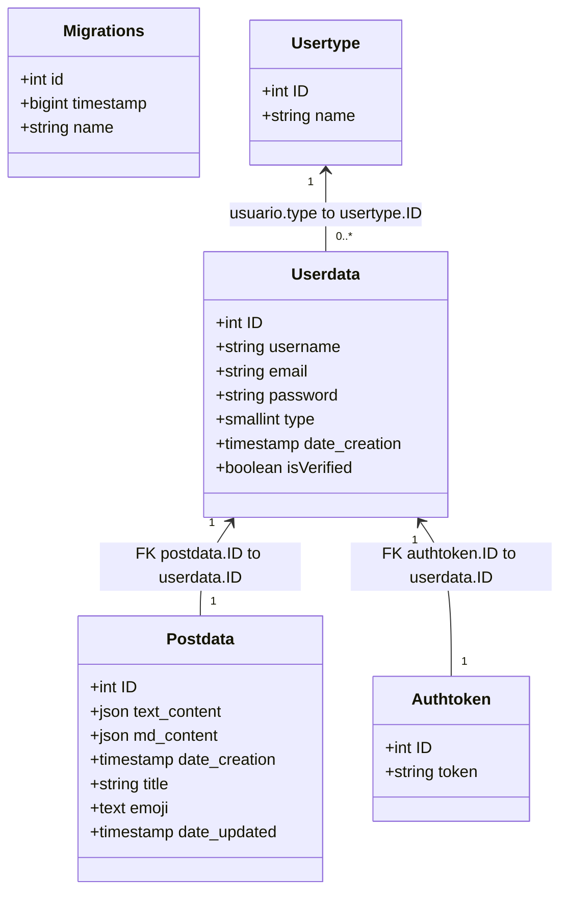

# Trabajo TFG Backend
## Esquema TFG Backend-Frontend

```mermaid
classDiagram
    class Userdata {
        +int ID
        +string username
        +string email
        +string password
        +smallint type
        +timestamp date_creation
        +boolean isVerified
    }

    class Postdata {
        +int ID
        +json text_content
        +json md_content
        +timestamp date_creation
        +string title
        +text emoji
        +timestamp date_updated
    }

    class Authtoken {
        +int ID
        +string token
    }

    class Migrations {
        +int id
        +bigint timestamp
        +string name
    }

    class Usertype {
        +int ID
        +string name
    }

    %% Relaciones
    Userdata "1" <-- "1" Postdata : FK postdata.ID to userdata.ID
    Userdata "1" <-- "1" Authtoken : FK authtoken.ID to userdata.ID
    Usertype "1" <-- "0..*" Userdata : usuario.type to usertype.ID
```