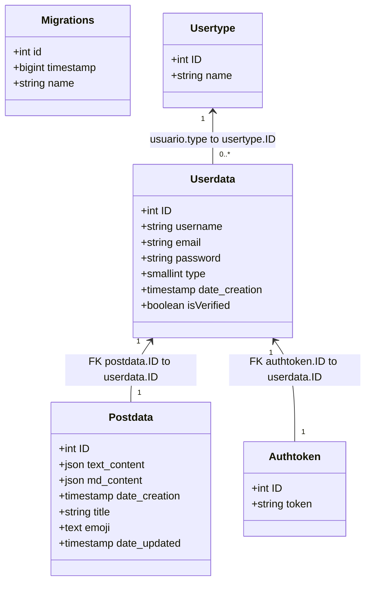

# TFG Backend API

API RESTful para gestión de blogs con autenticación JWT, verificación de email, y operaciones CRUD. Proyecto final de grado que sirve como backend para [blog.mapach.es](https://blog.mapach.es), una plataforma de blogging con funcionalidades completas de usuario y contenido.


## Características Principales
- Autenticación JWT con refresh tokens
- Sistema de verificación de email
- Recuperación de contraseña segura
- CRUD completo para posts/blog
- Roles de usuario (Admin/Premium/Free)
- Documentación Swagger integrada
- Dockerización completa
- Sistema de logging con Winston
- Pruebas automatizadas con Jest
- Análisis estático con SonarQube

## Diagrama de Clases


## Tecnologías Utilizadas
- **Backend**: Node.js 20, TypeScript 5
- **Framework**: Express 4
- **ORM**: TypeORM 0.3
- **Base de Datos**: PostgreSQL 16
- **Autenticación**: JWT, bcryptjs
- **Email**: Mailgun API
- **Documentación**: Swagger/OpenAPI 3
- **Contenedorización**: Docker + Docker Compose
- **Logging**: Winston
- **Testing**: Jest + SuperTest
- **Análisis de Código**: ESLint + SecretLint + SonarQube

## Instalación de paquetes
**Requisitos:**  
- Node.js 20+  
- Docker 20.10+  
- PostgreSQL 16 (si se va a ejecutar de forma local)

1. **Clonar el repositorio:**  
   Ejecuta lo siguiente en la terminal:
   ```bash
   git clone https://github.com/tu_usuario/TFG-Backend.git
   cd TFG-Backend
   ```

2. **Configurar variables de entorno:**  
   Copia el archivo de ejemplo y edítalo acorde a tu configuración:
   ```bash
   cp .env.template .env
   # Abre .env y actualiza las variables (DB, JWT, Mailgun, etc.)
   ```

3. **Instalar dependencias:**  
   Instala todos los paquetes necesarios con:
   ```bash
   npm install
   ```

4. **Ejecutar el servidor en modo desarrollo (opcional):**  
   Arranca la aplicación para probarla localmente:
   ```bash
   npm run dev
   ```

### 2. Despliegue del servidor con Docker

1. **Iniciar contenedores con Docker Compose:**  
   Levanta el entorno completo (Backend, Base de Datos, etc.) con:
   ```bash
   docker-compose -f docker/docker-compose.yml up --build -d
   ```

2. **Ejecutar migraciones de la base de datos:**  
   Una vez que los contenedores estén corriendo, ejecuta:
   ```bash
   docker exec -it tfg-backend npm run typeorm:migration-run
   ```

3. **Acceder a la API y servicios:**  
   - API: [http://localhost:3000](http://localhost:3000)  
   - Swagger UI: [http://localhost:3000/api-docs](http://localhost:3000/api-docs)  
   - Swagger UI (json): [http://localhost:3000/docs](http://localhost:3000/docs)  
   - PGAdmin: [http://localhost:5432](http://localhost:5432)  
   - SonarQube: [http://localhost:9000](http://localhost:9000)


## Uso de la API
La documentación completa está disponible en `/api-docs`. Endpoints principales:

| Método | Endpoint                     | Descripción                                                                                     |
| ------ | ---------------------------- | ----------------------------------------------------------------------------------------------- |
| GET    | /                            | Ruta de índice.                                                                                 |
| GET    | /tokenusername               | Devuelve el nombre de usuario extraído del token (requiere verificación y autenticación).       |
| GET    | /username                    | Devuelve el nombre de usuario.                                                                  |
| GET    | /usercontent                | Obtiene todos los posts del usuario (requiere verificación y autenticación).                    |
| GET    | /logout                     | Cierra la sesión del usuario.                                                                   |
| GET    | /verify-email                | Verifica el email del usuario.                                                                  |
| GET    | /posts                      | Obtiene todos los posts.                                                                        |
| GET    | /isverified                 | Retorna el estado de verificación del usuario a partir del token.                               |
| POST   | /login                      | Autenticación del usuario.                                                                      |
| POST   | /register                   | Registro de un nuevo usuario (utiliza middleware de validación de registro).                    |
| POST   | /submitcontent              | Crea un nuevo post (requiere verificación y autenticación).                                     |
| POST   | /send-verification-email    | Envía un correo de verificación.                                                                |
| POST   | /send-password-reset-email  | Envía un correo para restablecer la contraseña.                                                 |
| POST   | /reset-password             | Restablece la contraseña del usuario.                                                           |
| DELETE | /post/:id                   | Elimina un post específico (requiere verificación y autenticación).                             |
| DELETE | /user                       | Elimina al usuario autenticado.                                                                 |

Ejemplo de petición con cURL:
```bash
curl -X POST http://localhost:3000/login \
  -H "Content-Type: application/json" \
  -d '{"username":"usuario", "password":"contraseña"}'
```

## Estructura del Proyecto
```
📦 TFG-Backend
 ┣ 📂docker             # Configuración de Docker
 ┃ ┣ 📜docker-compose.dev.yml
 ┃ ┣ 📜docker-compose.sonarqube.yml
 ┃ ┗ 📜docker-compose.yml
 ┣ 📂img                # Imágenes y diagramas
 ┃ ┗ 📜esquema_backend_frontend.png
 ┣ 📂logs               # Archivos de logs
 ┃ ┣ 📜combined.log
 ┃ ┗ 📜error.log
 ┣ 📂postman            # Colecciones de Postman
 ┃ ┗ 📜TFG Backend API Collection.postman_collection.json
 ┣ 📂sql                # Exportaciones de la base de datos
 ┃ ┗ 📂exports
 ┃ ┃ ┗ 📜tfg_schema.sql
 ┣ 📂src                # Código fuente
 ┃ ┣ 📂controllers      # Controladores de la API
 ┃ ┣ 📂docs             # Documentación (Swagger)
 ┃ ┣ 📂interfaces       # Definición de interfaces
 ┃ ┣ 📂loaders          # Carga de módulos y configuración
 ┃ ┣ 📂middlewares      # Middlewares
 ┃ ┣ 📂models           # Modelos de datos
 ┃ ┣ 📂routes           # Definición de rutas
 ┃ ┣ 📂services         # Servicios y lógica de negocio
 ┃ ┣ 📂templates        # Plantillas de correos
 ┃ ┣ 📂utils            # Utilidades y helpers
 ┃ ┣ 📜app.ts
 ┃ ┗ 📜config.ts
 ┣ 📂tests              # Pruebas
 ┃ ┗ 📜app.test.ts
 ┣ 📜.dockerignore
 ┣ 📜.env.template
 ┣ 📜.gitignore
 ┣ 📜Dockerfile
 ┣ 📜eslint.config.js
 ┣ 📜jest.config.ts
 ┣ 📜LICENSE
 ┣ 📜package-lock.json
 ┣ 📜package.json
 ┣ 📜pnpm-lock.yaml
 ┣ 📜README.md
 ┣ 📜sonar-project.properties
 ┗ 📜tsconfig.json
```

## Testing y Calidad
```bash
# Ejecutar pruebas unitarias
npm test

# Generar reporte de cobertura
npm run test:coverage

# Análisis estático con SonarQube
npm run test:report
```

## Variables de Entorno Clave
```env
NODE_VERSION=20.17.0

FRONTEND_URL=http://localhost:3000
JWT_SECRET_KEY=your_jwt_secret
EXPIRATION_TIME=1h
DEVELOPMENT=false

DB_HOST=localhost
DB_PORT=5432
DB_USERNAME=your_db_username
DB_PASSWORD=your_db_password
DB_DATABASE=your_db_name
DB_SCHEMA=public

MAILGUN_API_KEY=your_mailgun_api_key
MAILGUN_DOMAIN=your_mailgun_domain
MAILGUN_EMAIL=your_mailgun_email
```

## Despliegue Continuo con GitHub Actions

Este proyecto utiliza GitHub Actions para automatizar el despliegue de la imagen Docker generada. Cada vez que se realiza un push a la rama principal, se ejecuta un workflow que realiza lo siguiente:
- **Construcción de la imagen Docker:** Se construye mediante el Dockerfile del repositorio.
- **Autenticación y Push:** Se autentica y se hace push a `ghcr.io` usando credenciales guardadas en GitHub Secrets.